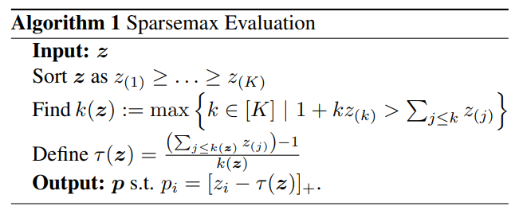

# From Softmax to Sparsemax: A Sparse Model of Attention and Multi-Label Classification

## 1. アブスト
本稿では、従来のソフトマックスに類似し、疎な確率を出力することができる新しい活性化関数であるsparsemaxを提案する。その特性を導き出した後、そのヤコビアンを効率的に計算する方法を示し、バックプロパゲーションで学習させたネットワークで使用することを可能にする。次に、ロジスティック損失のスパースマックスアナログである、新しい滑らかで凸の損失関数を提案する。この新しい損失とHuber分類損失との間の予期せぬ関係を明らかにする。我々は、マルチラベル分類問題や、自然言語推論のための注意に基づくニューラルネットワークにおいて、有望な経験的結果を得ることができた。後者については、従来のソフトマックスと同様の性能を達成しつつ、選択的でよりコンパクトな注意の焦点を持つ。

## 2. イントロ
### softmaxが魅力的な理由
1. 評価と微分が容易
2. 出力の対数をとることで，（凸）負の対数尤度損失関数に変換可能

### softmaxの代替案
1. the Bradley-Terry model (Bradley & Terry, 1952; Zadrozny, 2001; Menke & Martinez, 2008)
2. the multinomial probit (Albert & Chib, 1993)
3. the spherical softmax (Ollivier, 2013; Vincent, 2015; de Brebisson & Vincent, 2015)
4. softmax approximations (Bouchard, 2007)
* ただし，これらはsoftmaxの良い特性のいくつかを欠いている

### sparsemaxの提案
* 疎な出力を返すことができる特徴がある。この特性により、大規模な出力空間に対するフィルタとして、複数のラベルを予測するために、あるいは、いくつかの変数のうちどれが意思決定に関連する可能性があるかを識別するためのコンポーネントとして使用することができ、モデルをより解釈しやすくすることができるのが魅力的である。
* ソフトマックスの魅力的な特性のほとんどを維持したまま、これが実現されている。

### 本稿で示しているコントリビューション
* 新しいsparsemax変換を定式化し、その特性を導き出し、どのように効率的に計算できるかを示す。二項対立の場合、sparsemaxはハードシグモイドに還元されることを示す。
*  sparssemaxのヤコビアンを導き、softmaxの場合と比較し、gradient backpropagationの高速化につながることを示す。
* 我々は、ロジスティック回帰類似の新しい損失関数であるsparsemax損失を提案する。この損失関数は凸でどこでも微分可能であり，ロバスト統計学の重要なツールであるHuber分類損失を多クラス一般化したものと見なすことができる。
* sparsemax損失を適用し、ベンチマークデータセットにおいてマルチラベル線形分類器（単一のラベルではなく、ラベルの集合を予測する）を学習する。
* sparsemaxを用いた神経選択的注意機構を考案し、自然言語推論問題でその性能を評価し、有望な結果を得た。

## 3. sparsemaxについて
### アルゴリズム
 
1. zを降順に並べる
2. k(z)を求める（k(z)は，降順に並べたzのうち，確率piがpi>0となる最大のインデックス。つまりpiがpi>0となる集合とpi=0となる集合の境界。）
3. τ(z)を求める（τ(z)は，pi>0の領域とpi=0の領域を分ける閾値）
4. piを求める（各zの確率）

### 定義
sparsemaxは以下のように定義されている。

$$
\operatorname{sparsemax}(z):=\underset{p \in \Delta^{K-1}}{\operatorname{argmin}}\|\boldsymbol{p}-\boldsymbol{z}\|^{2}
$$
ただし，$\Delta^{K-1}$は，pがK次元，pの和は1，pi>=0を表す。

### 参考文献
https://data-analytics.fun/2021/08/17/understanding-sparsemax/

### 特質
* softmaxをハードにしたもの

### ヤコビアン
* 微分可能性 → S(z)が変化する点(p>0, p=0の境界)を除けば，すべての点で微分可能
* sparsemaxの微分
$$
\frac{\partial \operatorname{sparsemax}_{i}(\boldsymbol{z})}{\partial z_{j}}= \begin{cases}\delta_{i j}-\frac{\partial \tau(\boldsymbol{z})}{\partial z_{j}}, & \text { if } z_{i}>\tau(\boldsymbol{z}) \\ 0, & \text { if } z_{i} \leq \tau(\boldsymbol{z})\end{cases}
$$
* τ(z)の微分
$$
\frac{\partial \tau(z)}{\partial z_{j}}= \begin{cases}\frac{1}{|S(z)|} & \text { if } j \in S(\boldsymbol{z}) \\ 0, & \text { if } j \notin S(\boldsymbol{z}) .\end{cases}
$$
* $j \in S(\boldsymbol{z}) \Leftrightarrow z_{j}>\tau(\boldsymbol{z})$であることに注意すると，以下の式が得られる。
$$
\frac{\partial \operatorname{sparsemax}_{i}(\boldsymbol{z})}{\partial z_{j}}= \begin{cases}\delta_{i j}-\frac{1}{|S(\boldsymbol{z})|}, & \text { if } i, j \in S(\boldsymbol{z}), \\ 0, & \text { otherwise. }\end{cases}
$$